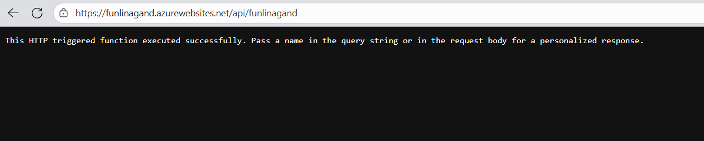
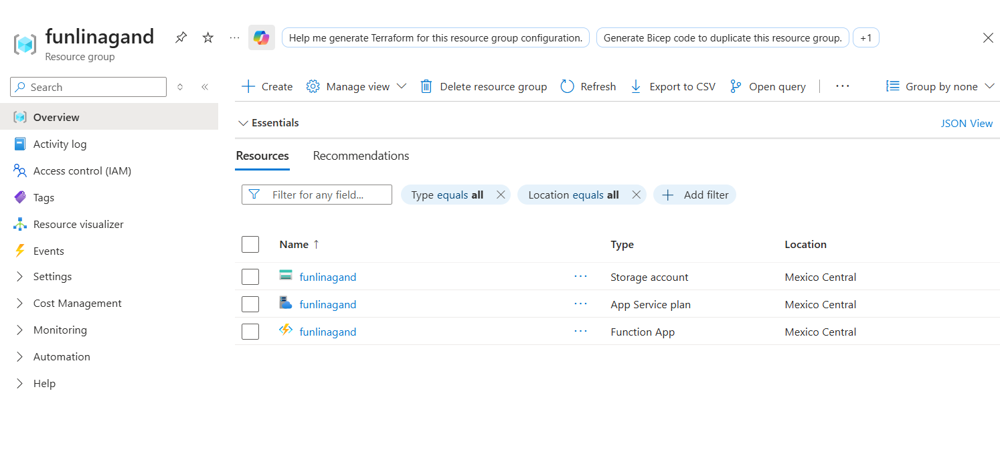

To establish the connection with Azure and deploy the function defined in the Terraform configuration file, the standard workflow commands were executed: terraform init, terraform plan, and terraform apply.

During the process, several issues arose, initially related to the selected region and later to the App Service Plan SKU. The configured SKU was not available in the specified region, and in addition, the subscription did not have the necessary quota to use some of the tested service levels. This required iterative adjustments to the configuration, validating different combinations of regions and SKUs until a compatible and supported option was identified.

Finally, the deployment was successfully completed in the Central Mexico region, using the S1 (Standard) SKU. Once these limitations were resolved, it was possible to provision the infrastructure correctly and access the generated web resource, as shown below:

Translated with DeepL.com (free version)

Similarly, resource creation is validated in Azure: 

